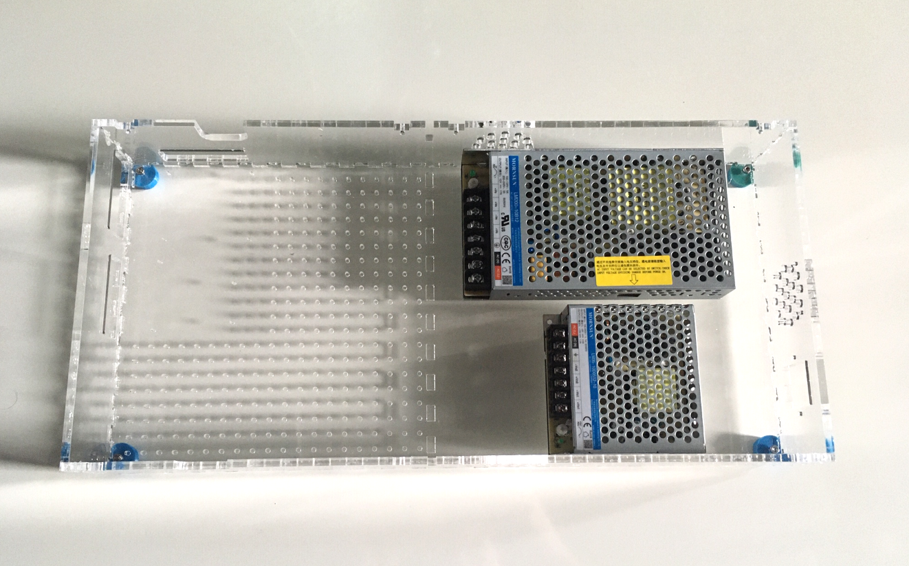
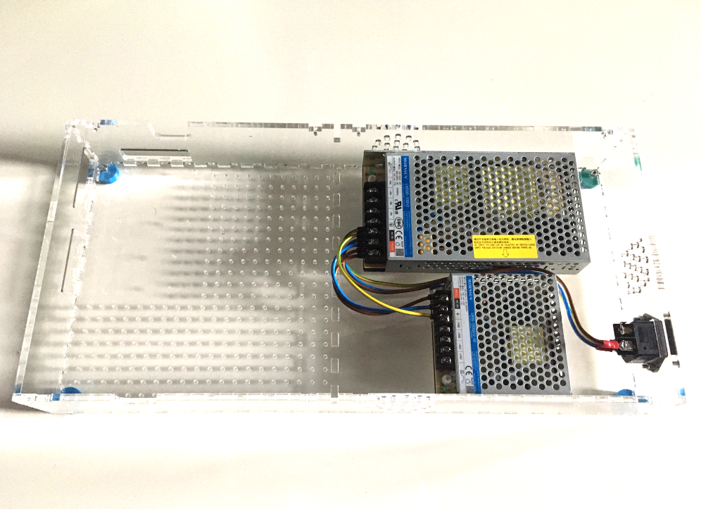
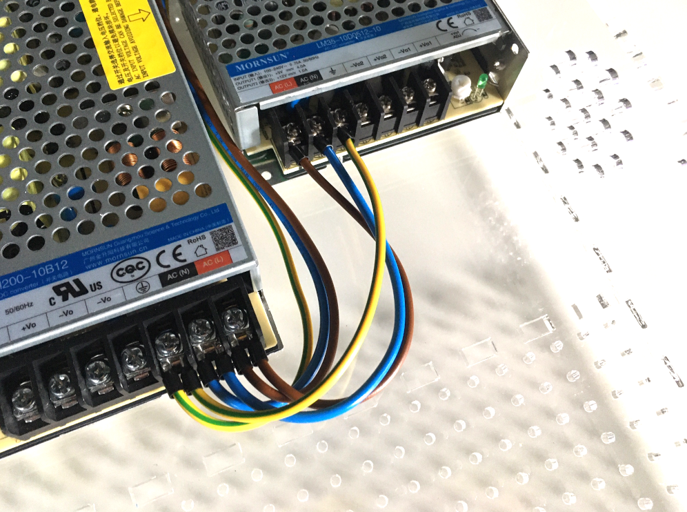
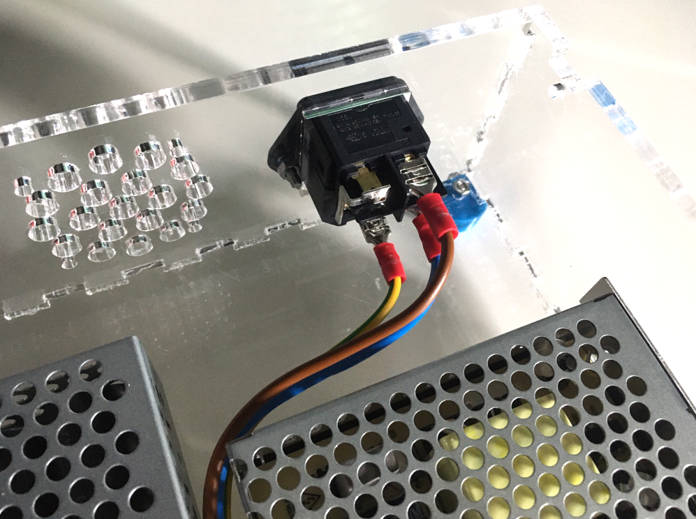
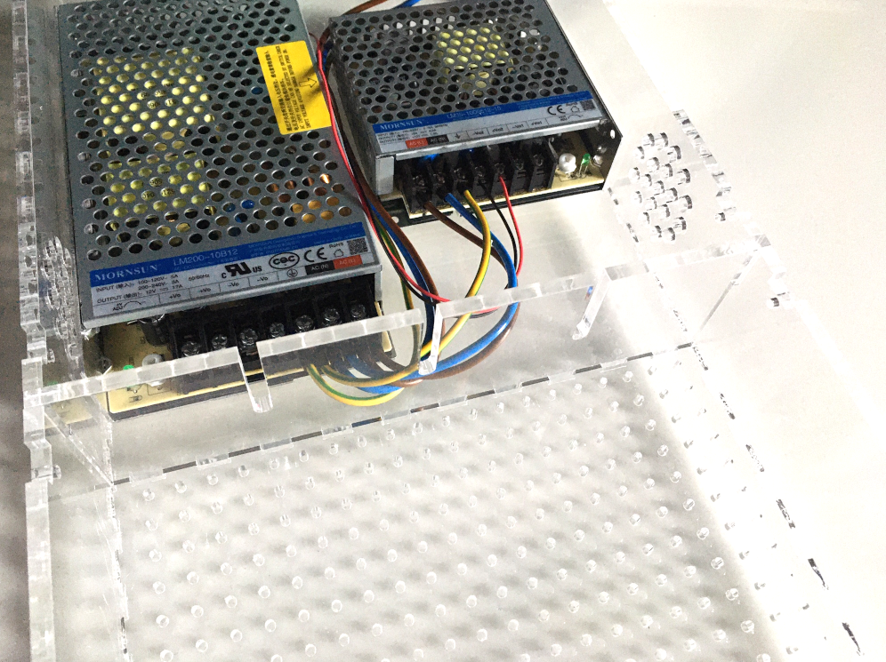
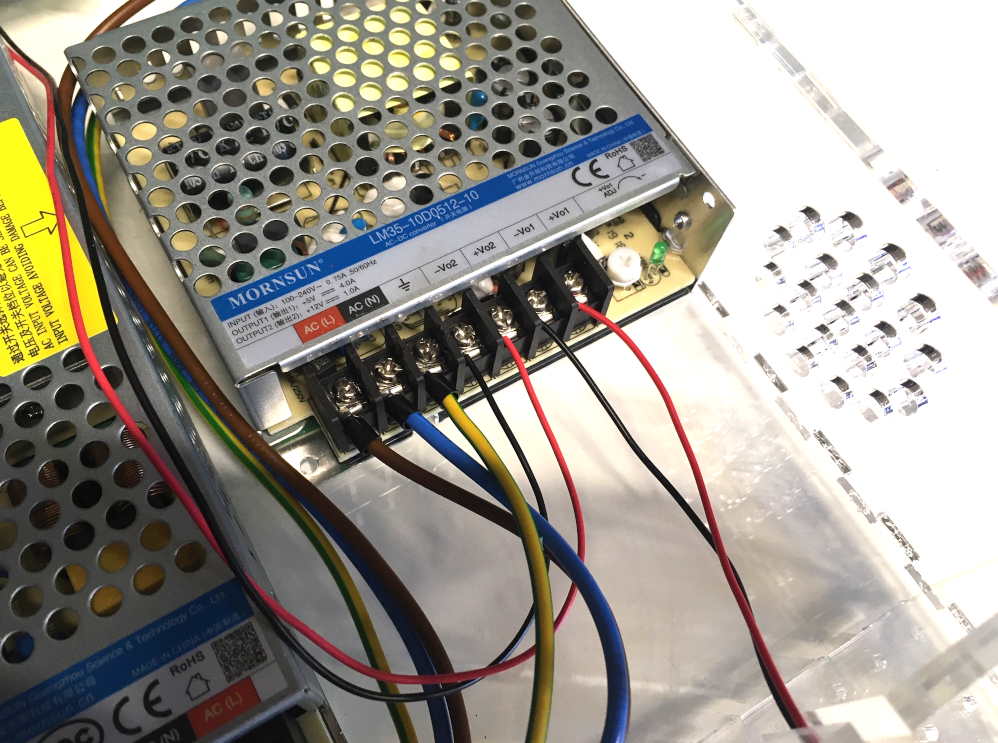
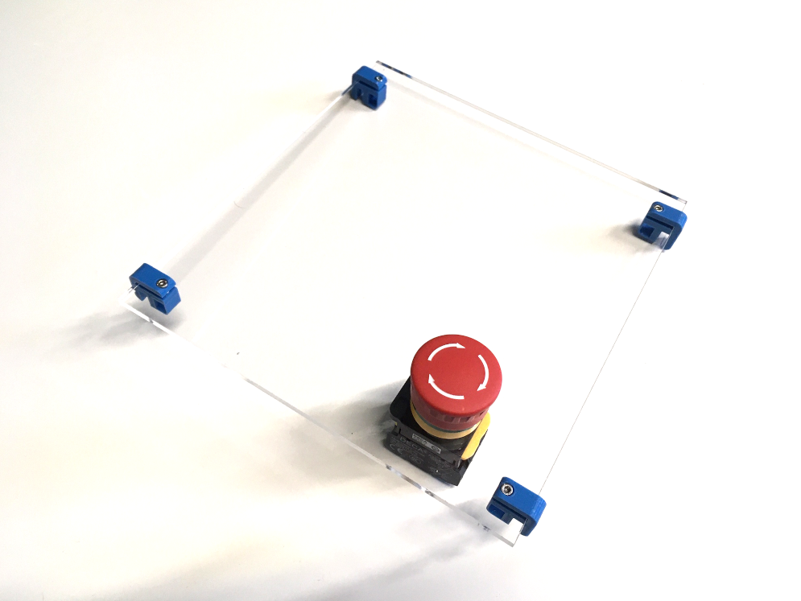
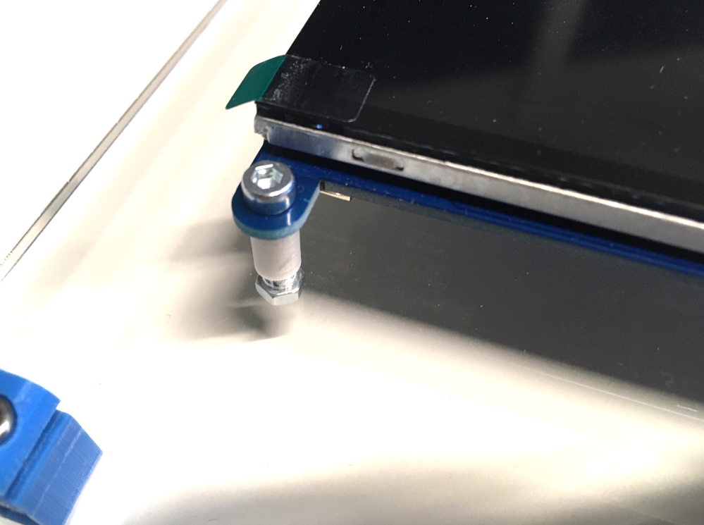
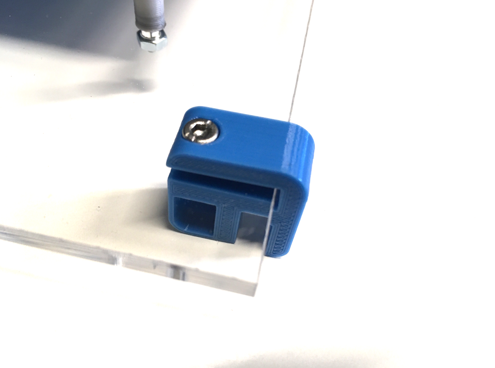

# Power Suply Unit and control box
You will fin here how to make the box for PSU and control.

## Cut the PMMA sheets {pagestep}
Cut the [5 mm PMMA sheets](Parts.yaml#PMMAsheet){qty:2} (2 sheets should be enough). Files are available for laser cutter with [DXF format by clicking here](files/dxf/psu_control_box.dxf), and the FreeCAD files are availables by clicking here if you want to make any change or export the files in another format.  

These pieces were cut on a [60W CO2 laser cutter](Parts.yaml#LaserCutter){qty:1, Cat: tool}, with the following parameters (*note that the parameters depend on the machine and its laser power*):  
* Speed : 5 mm/s;  
* Power : 100%.  

  

## Glue the PMMA sheets {pagestep}
For this step, we recommend to assemble the box in a first place to make sure the cut work properly, and to avoid gluing parts the wrong way. On the followinf image, the pieces to glue are shown with red edges where glue should be added.  
  

  
Glue the PMMA sheets you just cut with [glue for acrylic sheets](Parts.yaml#AcrylicGlue){qty:1, Cat:part}. For clean gluing, use [masking tape](Parts.yaml#MaskingTape){qty:1} on borders near the parts were the glue is applied.  

## Add the feet {pagestep}
 
 
 

## Power supply units {pagestep}
 
 

## Power outlet {pagestep}
 
 

## Wiring {pagestep}
 
 
 
 
 

## Fan {pagestep}
 
 
 

## Separation between PSU and CTRL
 


## Control : RaspberryPi
 
 
 
 
 
 
 

## Control : Arduino
 
 
 

## CNC shield
 
 
 
 

## PSU lid
 
 
 
 
 
 

## Control lid
 
 
 

## Upload the firmware : Grbl {pagestep}
To upload Grbl on the Arduino board, just follow instructions available on [Grbl's wiki ](https://github.com/gnea/grbl/wiki/Compiling-Grbl).  

Once Grbl is compiled and flashed to the Arduino board, it is a good idea to have default settings in a first place. Open the Serial Monitor in the Arduino IDE (Tools > Serial Monitor), then check Grbl settings typing `$$` then Enter, into the Serial Monitor. The settings should look like this (according to [Grbl wiki : Grbl v1.1 Configuration](https://github.com/gnea/grbl/wiki/Grbl-v1.1-Configuration)) :  
```
Settings and sample values 	Description
$0=10 	Step pulse, microseconds
$1=25 	Step idle delay, milliseconds
$2=0 	Step port invert, mask
$3=0 	Direction port invert, mask
$4=0 	Step enable invert, boolean
$5=0 	Limit pins invert, boolean
$6=0 	Probe pin invert, boolean
$10=1 	Status report, mask
$11=0.010 	Junction deviation, mm
$12=0.002 	Arc tolerance, mm
$13=0 	Report inches, boolean
$20=0 	Soft limits, boolean
$21=0 	Hard limits, boolean
$22=1 	Homing cycle, boolean
$23=0 	Homing dir invert, mask
$24=25.000 	Homing feed, mm/min
$25=500.000 	Homing seek, mm/min
$26=250 	Homing debounce, milliseconds
$27=1.000 	Homing pull-off, mm
$30=1000. 	Max spindle speed, RPM
$31=0. 	Min spindle speed, RPM
$32=0 	Laser mode, boolean
$100=250.000 	X steps/mm
$101=250.000 	Y steps/mm
$102=250.000 	Z steps/mm
$110=500.000 	X Max rate, mm/min
$111=500.000 	Y Max rate, mm/min
$112=500.000 	Z Max rate, mm/min
$120=10.000 	X Acceleration, mm/sec^2
$121=10.000 	Y Acceleration, mm/sec^2
$122=10.000 	Z Acceleration, mm/sec^2
$130=200.000 	X Max travel, mm
$131=200.000 	Y Max travel, mm
$132=200.000 	Z Max travel, mm
```
If not, then copy each line, and paste it into the Serial Monitor.


  
  

