# Power Suply Unit and control box

{{BOM}}

You will find here how to make the box for PSU and control. Get yourself a [screwdriver set](Parts.yaml#Screwdriverset){qty:1} since there are a lot of screws!

## Cut the PMMA sheets {pagestep}
Cut the [5 mm PMMA sheets](Parts.yaml#PMMAsheet){qty:2} (2 sheets should be enough). Files are available for laser cutter with [DXF format by clicking here](files/dxf/psu_control_box.dxf), and the FreeCAD files are availables by clicking here if you want to make any change or export the files in another format.  

These pieces were cut on a [60W CO2 laser cutter](Parts.yaml#LaserCutter){qty:1, Cat: tool}, with the following parameters (*note that the parameters depend on the machine and its laser power*):  
* Speed : 5 mm/s;  
* Power : 100%.  

  

## Glue the PMMA sheets {pagestep}
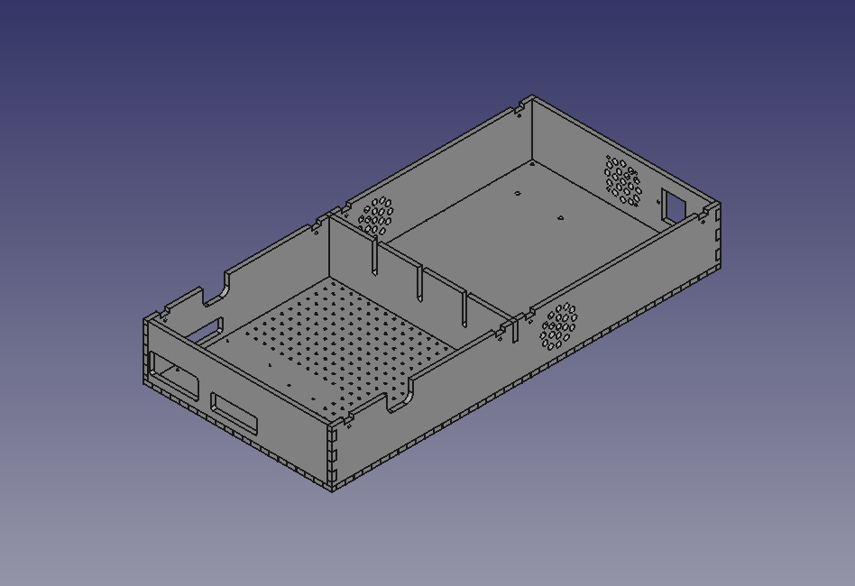
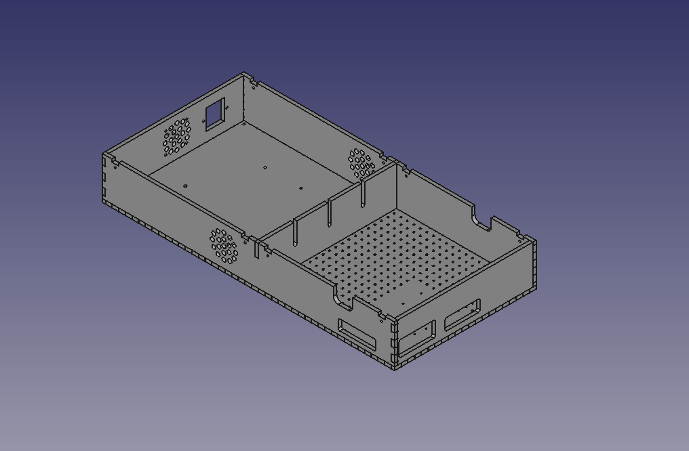

For this step, we recommend to assemble the box in a first place to make sure the cut work properly, and to avoid gluing parts the wrong way. On the following image, the pieces to glue are shown with red edges where glue should be added.  
  
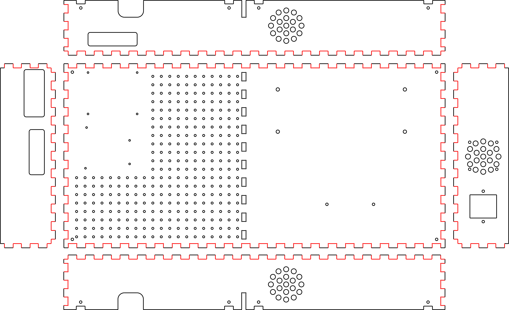
  
Glue the PMMA sheets you just cut with [glue for acrylic sheets](Parts.yaml#AcrylicGlue){qty:1, Cat:part}. For clean gluing, use [masking tape](Parts.yaml#MaskingTape){qty:1} on borders near the parts were the glue is applied.  

## Add the feet {pagestep}
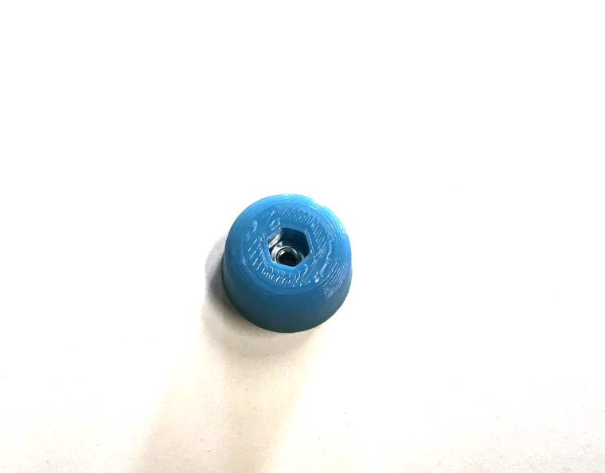 
 
 
First, 3D print 4 [3D printed feet](files/stl/foot.stl){qty:4}. Insert 4x [M3 nuts](Parts.yaml#M3nut){qty:4} into the feet, then screw the feet with x4 [M3x8mm screws](Parts.yaml#M3x8mm){qty:4} onto the PMMA box.

## Power supply units {pagestep}
 
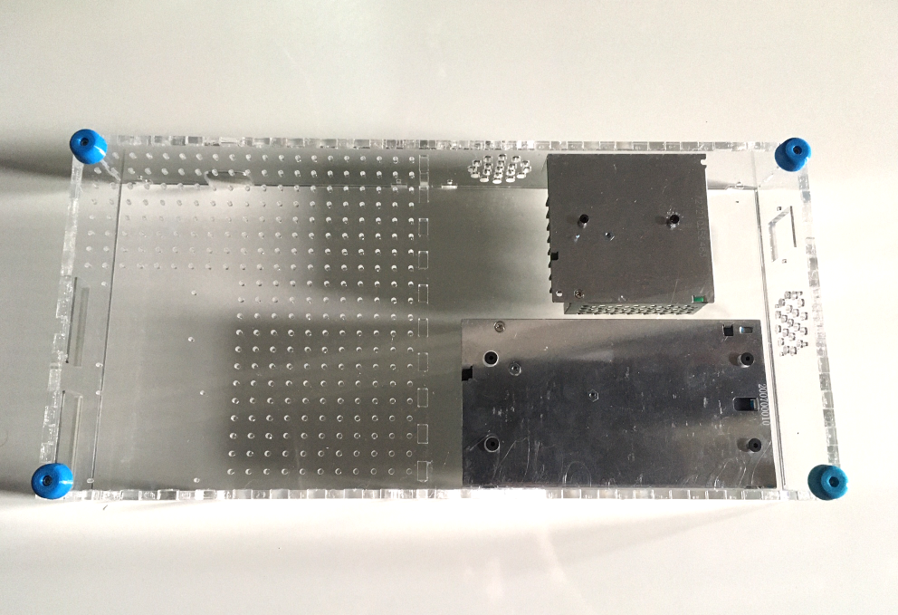 
Attach the [PSU for RaspberryPi](Parts.yaml#PSU1){qty:1} with 2x [M3x8mm screws](Parts.yaml#M3x8mm){qty:2}. Then attach the [PSU for CNC shield and motors](Parts.yaml#PSU2){qty:1} with [M4x10mm screws](Parts.yaml#M4x10mm){qty:4}.

## Power outlet {pagestep}
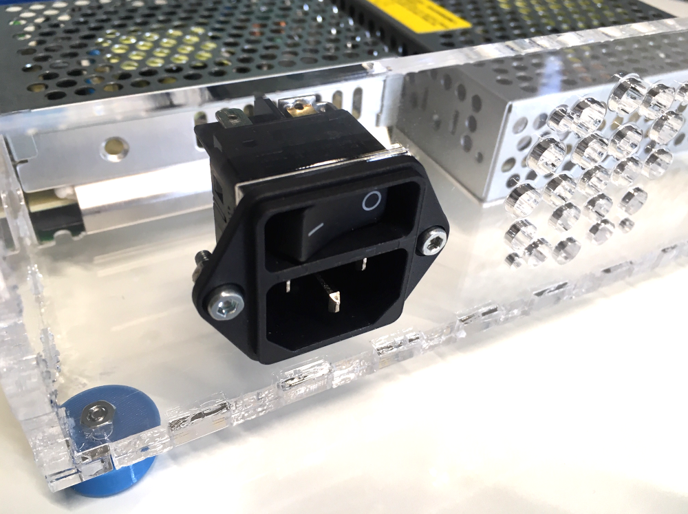 
 
Simply attache the power outlet with 2x [M3x8mm screws](Parts.yaml#M3x8mm){qty:2} and 2x [M3 nuts](Parts.yaml#M3nut){qty:2}.

## Wiring {pagestep}
 
 
 
 
 
To wire the PSUs to the power outlet, you will need a minimum of 45 cm of [blue cable](Parts.yaml#blue_cable){qty: "45 cm"}, and [brown cable](Parts.yaml#brown_cable){qty: "45 cm"} and [yellow cable](Parts.yaml#yellow_cable){qty: "45 cm"}. For each one, you can cut: 
* 30 cm to connect the power outler to the PSU for CNC shield and motors;
* 15 cm to connect both PSU.
Strip the cables on about 10 mm (for example with [crimping pliers](Parts.yaml#crimpingPliers){qty:1, Cat:Tool}). On 15 cm long cables,  crimp the fitting [ferrules](Parts.yaml#ferrules){qty:6} on each end of the cables. On 30 cm long cables, crimp [ferrules](Parts.yaml#ferrules){qty:3} on 1 end, and [crimp connectors](Parts.yaml#crimpConn){qty:3} on the other end of the cables.

## Fan {pagestep}
 
 
 
Attach the [fan](Parts.yaml#fan){qty:1} with 4x [M3x18mm screws](Parts.yaml#M3x18mm){qty:4} and [M3 nuts](Parts.yaml#M3nut){qty:4}.

## Separation between PSU and CTRL {pagestep}
 

## Control : RaspberryPi {pagestep}
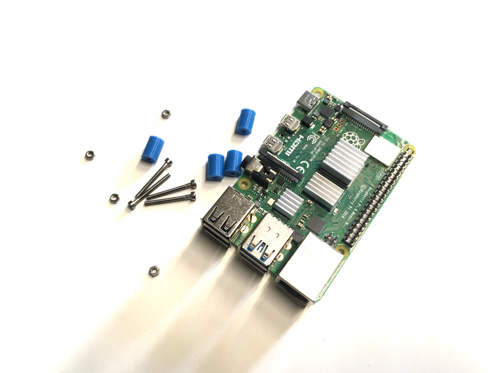 
 
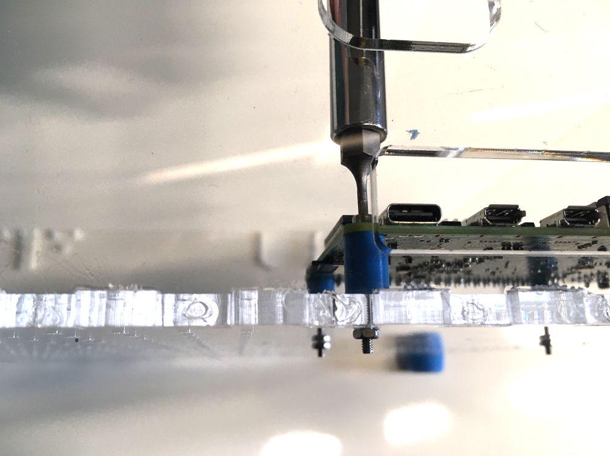 
 
 
 
 
Attach the [RaspberryPi](Parts.yaml#RPi){qty:1} with 4x [M2x20 mm screws](Parts.yaml#M2x20mm){qty:2} and 4x [M2 nuts](Parts.yaml#M2nut){qty:4}, adding 4x [3D printed M2x10mm spacers](files/stl/M2_spacer.stl){qty:4}. Finally, connect the RPi to the [PSU for RaspberryPi] with [these wires](Parts.yaml#RPiWires){qty:1}.

## Control : Arduino {pagestep}
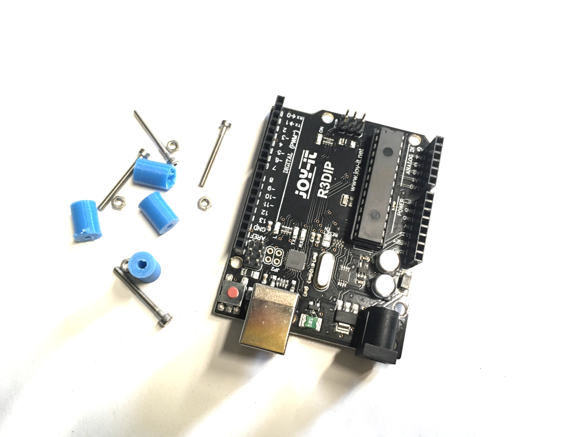 
 
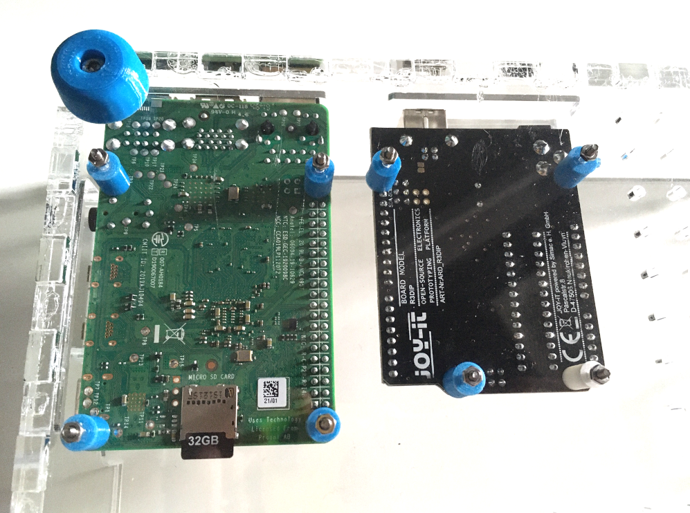 
Beside the RaspberryPi, attach the [Arduino board](Parts.yaml#Arduino){qty:1} with 4x [M2x20 mm screws](Parts.yaml#M2x20mm){qty:2} and 4x [M2 nuts](Parts.yaml#M2nut){qty:4}, adding 4x [3D printed M2x10mm spacers](files/stl/M2_spacer.stl){qty:4}.

## CNC shield {pagestep}
 
 
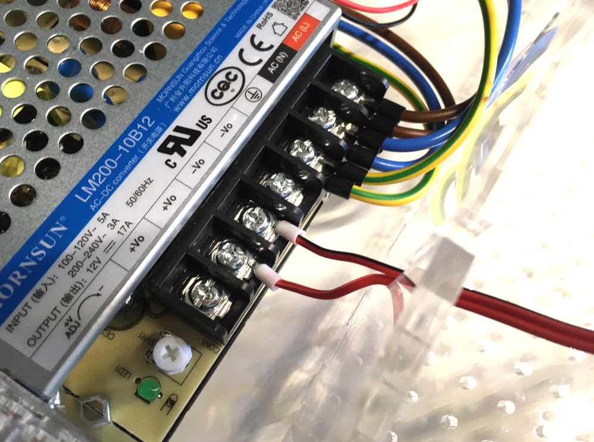 
 
Cut 35 cm of [cables](Parts.yaml#CNCCable){qty:"35 cm"}, strip it on 10 mm with the [crimping pliers], then add the [ferrules]{qty:4}.  
Plug the [CNC shield](Parts.yaml#CNCShield){qty:1} onto the [Arduino board]. Make sure to plug the A4899 drivers correctly on the CNC shield.  
Make sure you connect the black wire to -Vo on the [PSU for CNC shield and motors], and red wire to +Vo. The similarly connect the red wire to + on the [CNC shield], and black wire to -.

## PSU lid {pagestep}
 
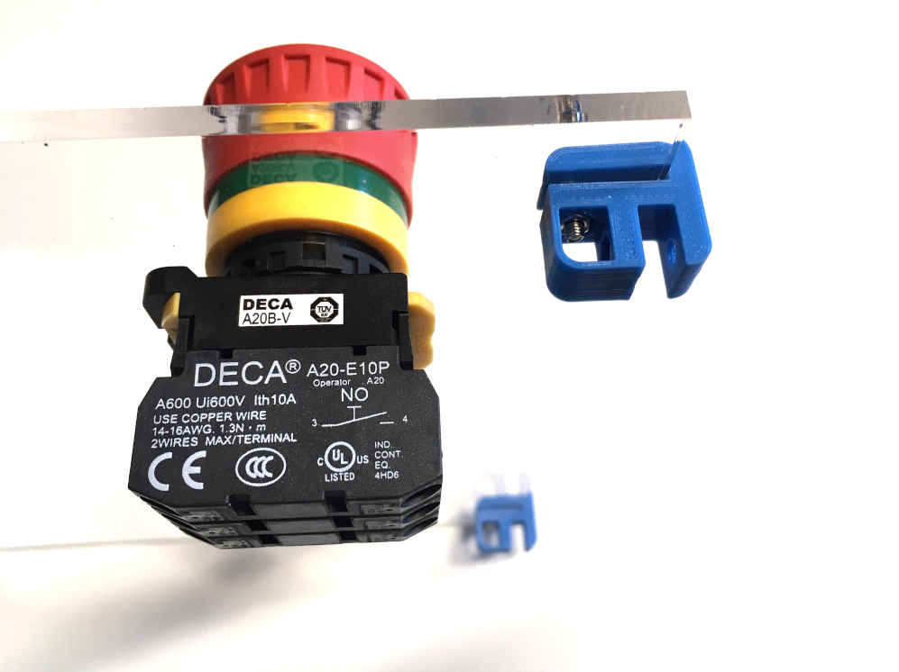 
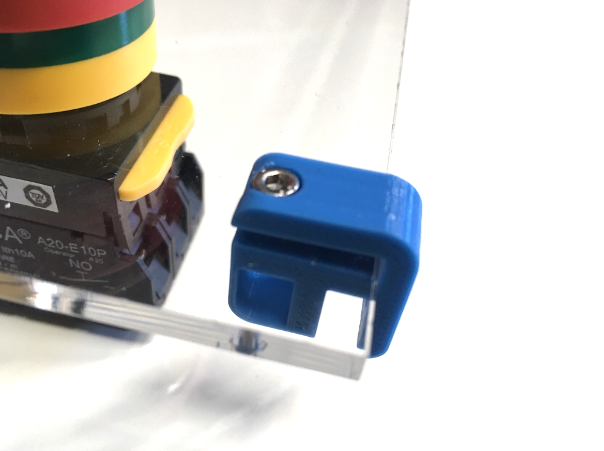 
 
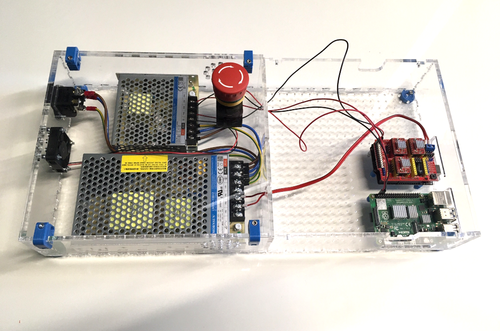 

Attach the [emergency button](Parts.yaml#EmergencyButton){qty:1} to the PSU lid. Connect [these wires]{qty:1} to the emergency button, then to the CNC shield, on "E-STOP" pins.  
Then fix 4x [3D printed attaches](files/stl/lid_attach.stl){qty:4} with [M3x10mm screws](Parts.yaml#M3x10mm){qty:4} and [M3 nuts]{qty:4}.

## Control lid {pagestep}
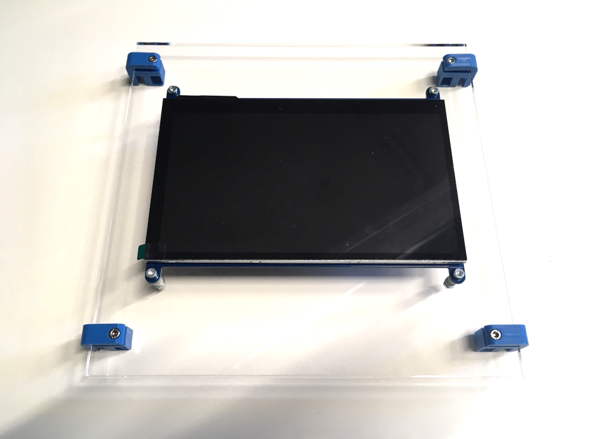 
 
 
Attach 4x [3D printed attaches]{qty:4} on the control lid, with [M3x10mm screws]{qty:4} and [M3 nuts]{qty:4}.
Then attach the [touch screen](Parts.yaml#TouchScreen){qty:1} with 4x [M3 nuts]{qty:4}, 4x [M3x18mm screws]{qty:4} and 4x [3D printed M3 spacers](files/stl/M3_spacer.stl){qty:4}.

## Close the box {pagestep}
 
If you want to close the box, then you will need 8x [M3x10mm screws]{qty:8} and [M3 nuts] more.

## Connect everything
* Connect the RaspberryPi to the Arduino board with a USB cable;
* Connect the RaspberryPi the the screen with an HDMI cable (micro-HDMI connector for the RPi4);
* Connect the RaspberryPi to the screen with a micro-USB cable (for touch screen)
* OPTIONAL : connect a mouse to the RaspberryPi;
* OPTIONAL : connect a keyboard to the RaspberryPi;
* OPTIONAL : connect a bigger monitor to the RaspberryPi.

  
  

