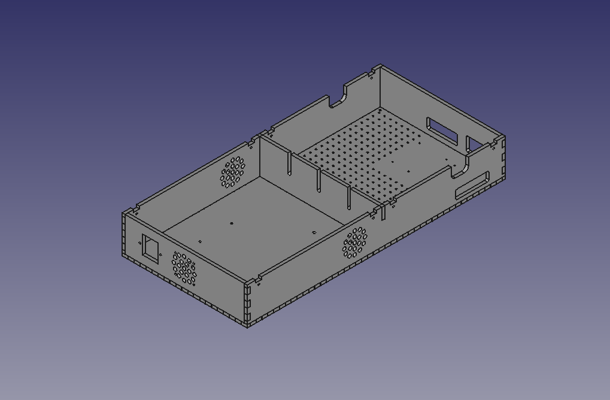
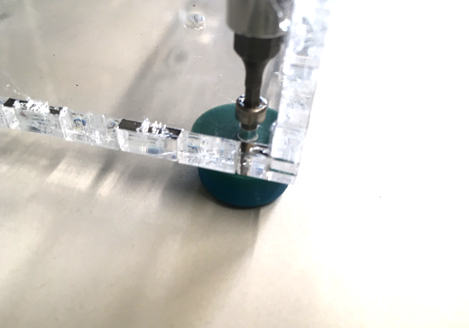
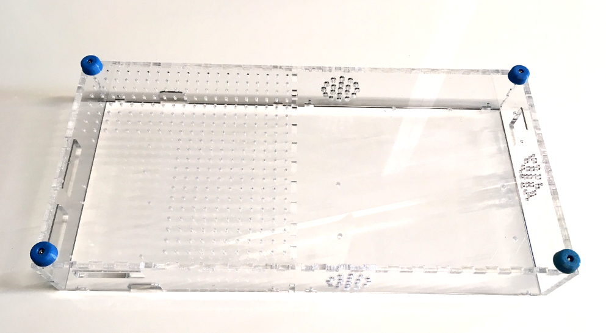
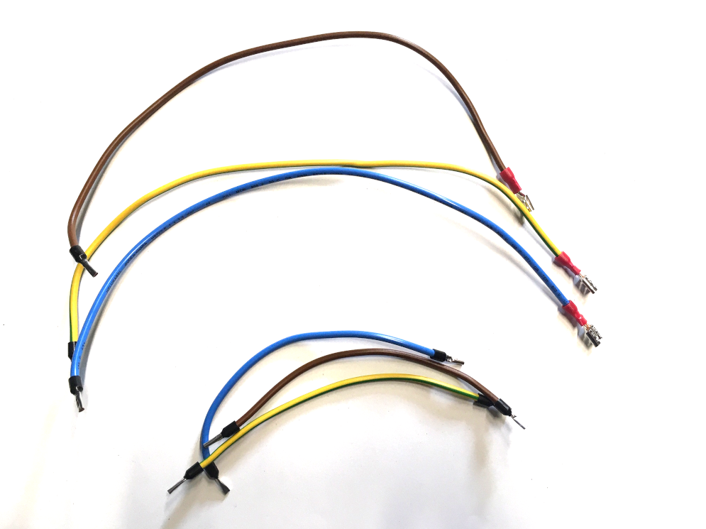
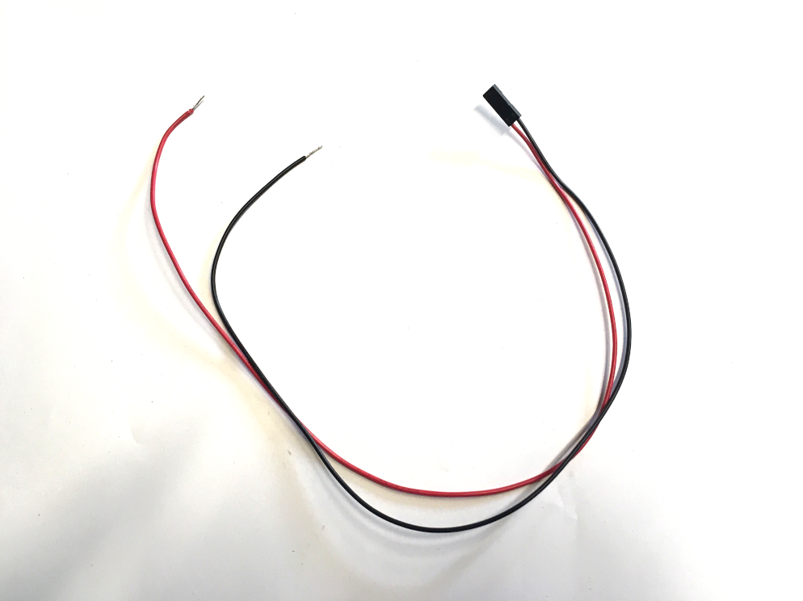
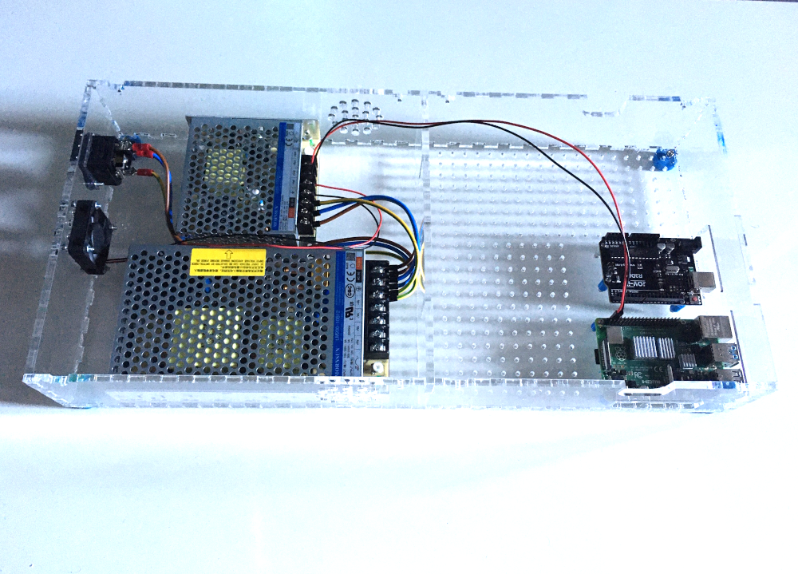
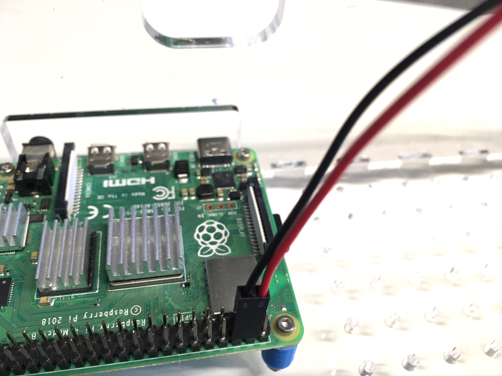
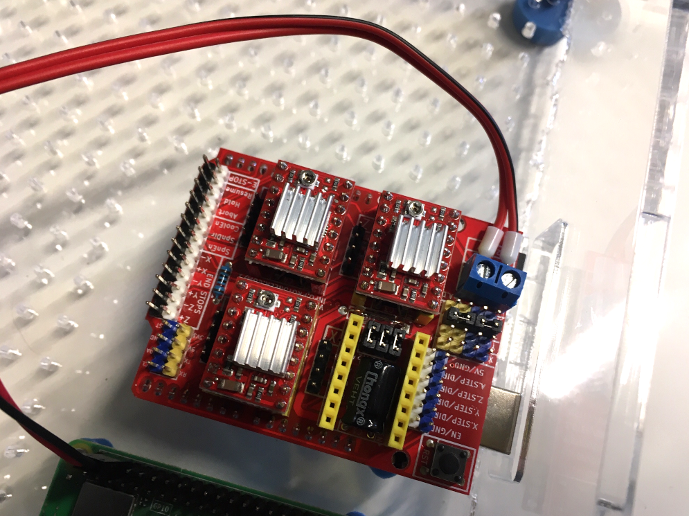
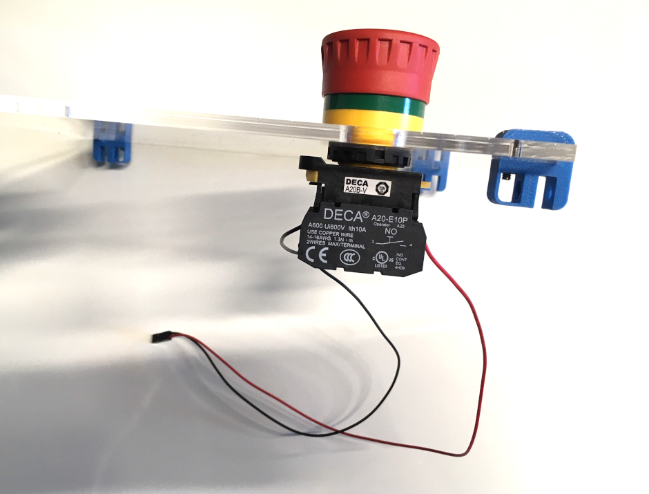

# Power Suply Unit and control box
You will fin here how to make the box for PSU and control.

## Cut the PMMA sheets {pagestep}
Cut the [5 mm PMMA sheets](Parts.yaml#PMMAsheet){qty:2} (2 sheets should be enough). Files are available for laser cutter with [DXF format by clicking here](files/dxf/psu_control_box.dxf), and the FreeCAD files are availables by clicking here if you want to make any change or export the files in another format.  

These pieces were cut on a [60W CO2 laser cutter](Parts.yaml#LaserCutter){qty:1, Cat: tool}, with the following parameters (*note that the parameters depend on the machine and its laser power*):  
* Speed : 5 mm/s;  
* Power : 100%.  

  

## Glue the PMMA sheets {pagestep}





For this step, we recommend to assemble the box in a first place to make sure the cut work properly, and to avoid gluing parts the wrong way. On the following image, the pieces to glue are shown with red edges where glue should be added.  
  

  
Glue the PMMA sheets you just cut with [glue for acrylic sheets](Parts.yaml#AcrylicGlue){qty:1, Cat:part}. For clean gluing, use [masking tape](Parts.yaml#MaskingTape){qty:1} on borders near the parts were the glue is applied.  

## Add the feet {pagestep}
 
 
 
First, 3D print 4 [3D printed feet](files/stl/foot.stl){qty:4}. Insert 4x [M3 nuts](Parts.yaml#M3nut){qty:4} into the feet, then screw the feet with x4 [M3x8mm screws](Parts.yaml#M3x8mm){qty:4} onto the PMMA box.

## Power supply units {pagestep}
 
 
Attach the [PSU for RaspberryPi](Parts.yaml#PSU1){qty:1} with 2x [M3x8mm screws](Parts.yaml#M3x8mm){qty:2}. Then attach the [PSU for CNC shield and motors](Parts.yaml#PSU2){qty:1} with [M4x10mm screws](Parts.yaml#M4x10mm){qty:4}.

## Power outlet {pagestep}
 
 
Simply attache the power outlet with 2x [M3x8mm screws](Parts.yaml#M3x8mm){qty:2} and 2x [M3 nuts](Parts.yaml#M3nut){qty:2}.

## Wiring {pagestep}
 
 
 
 
 
To wire the PSUs to the power outlet, you will need a minimum of 45 cm of [blue cable](Parts.yaml#blue_cable){qty: "45 cm"}, and [brown cable](Parts.yaml#brown_cable){qty: "45 cm"} and [yellow cable](Parts.yaml#yellow_cable){qty: "45 cm"}. For each one, you can cut: 
* 30 cm to connect the power outler to the PSU for CNC shield and motors;
* 15 cm to connect both PSU.
Strip the cables on about 10 mm (for example with [crimping pliers](Parts.yaml#crimpingPliers){qty:1, Cat:Tool}). On 15 cm long cables,  crimp the fitting [ferrules](Parts.yaml#ferrules){qty:6} on each end of the cables. On 30 cm long cables, crimp [ferrules](Parts.yaml#ferrules){qty:3} on 1 end, and [crimp connectors](Parts.yaml#crimpConn){qty:3} on the other end of the cables.

## Fan {pagestep}
 
 
 
Attach the [fan](Parts.yaml#fan){qty:1} with 4x [M3x18mm screws](Parts.yaml#M3x18mm){qty:4} and [M3 nuts](Parts.yaml#M3nut){qty:4}.

## Separation between PSU and CTRL
 


## Control : RaspberryPi
 
 
 
 
 
 
 
Attach the [RaspberryPi](Parts.yaml#RPi){qty:1} with 4x [M2x20 mm screws](Parts.yaml#M2x20mm){qty:2} and 4x [M2 nuts](Parts.yaml#M2nut){qty:4}, adding 4x [3D printed M2x10mm spacers](files/stl/M2_spacer.stl){qty:4}. Finally, connect the RPi to the [PSU for RaspberryPi] with [these wires](Parts.yaml#RPiWires){qty:1}.

## Control : Arduino
 
 
 
Beside the RaspberryPi, attach the [Arduino board](Parts.yaml#Arduino){qty:1} with 4x [M2x20 mm screws](Parts.yaml#M2x20mm){qty:2} and 4x [M2 nuts](Parts.yaml#M2nut){qty:4}, adding 4x [3D printed M2x10mm spacers](files/stl/M2_spacer.stl){qty:4}.

## CNC shield
 
 
 
 
Cut 35 cm of [cables](Parts.yaml#CNCCable){qty:"35 cm"}, strip it on 10 mm with the [crimping pliers], then add the [ferrules]{qty:4}.  
Plug the [CNC shield](Parts.yaml#CNCShield){qty:1} onto the [Arduino board].  
Make sure you connect the black wire to -Vo on the [PSU for CNC shield and motors], and red wire to +Vo. The similarly connect the red wire to + on the [CNC shield], and black wire to -.

## PSU lid
 
 
 
 
 
 

Attach the [emergency button](Parts.yaml#EmergencyButton){qty:1} to the PSU lid. Connect [these wires]{qty:1} to the emergency button, then to the CNC shield, on "E-STOP" pins.  
Then fix 4x [3D printed attaches](files/stl/lid_attach.stl){qty:4} with [M3x10mm screws](Parts.yaml#M3x10mm){qty:4} and [M3 nuts]{qty:4}.

## Control lid
 
 
 
Attach 4x [3D printed attaches]{qty:4} on the control lid, with [M3x10mm screws]{qty:4} and [M3 nuts]{qty:4}.
Then attach the [touch screen](Parts.yaml#TouchScreen){qty:1} with 4x [M3 nuts]{qty:4}, 4x [M3x18mm screws]{qty:4} and 4x [3D printed M3 spacers](files/stl/M3_spacer.stl){qty:4}.

## Close the box
If you want to close the box, then you will need 8x [M3x10mm screws]{qty:8} and [M3 nuts] more.

## Upload the firmware : Grbl {pagestep}
To upload Grbl on the [Arduino board], just follow instructions available on [Grbl's wiki ](https://github.com/gnea/grbl/wiki/Compiling-Grbl).  

Once Grbl is compiled and flashed to the Arduino board, it is a good idea to have default settings in a first place. Open the Serial Monitor in the Arduino IDE (Tools > Serial Monitor), then check Grbl settings typing `$$` then Enter, into the Serial Monitor. The settings should look like this (according to [Grbl wiki : Grbl v1.1 Configuration](https://github.com/gnea/grbl/wiki/Grbl-v1.1-Configuration)) :  
```
Settings and sample values 	Description
$0=10 	Step pulse, microseconds
$1=25 	Step idle delay, milliseconds
$2=0 	Step port invert, mask
$3=0 	Direction port invert, mask
$4=0 	Step enable invert, boolean
$5=0 	Limit pins invert, boolean
$6=0 	Probe pin invert, boolean
$10=1 	Status report, mask
$11=0.010 	Junction deviation, mm
$12=0.002 	Arc tolerance, mm
$13=0 	Report inches, boolean
$20=0 	Soft limits, boolean
$21=0 	Hard limits, boolean
$22=1 	Homing cycle, boolean
$23=0 	Homing dir invert, mask
$24=25.000 	Homing feed, mm/min
$25=500.000 	Homing seek, mm/min
$26=250 	Homing debounce, milliseconds
$27=1.000 	Homing pull-off, mm
$30=1000. 	Max spindle speed, RPM
$31=0. 	Min spindle speed, RPM
$32=0 	Laser mode, boolean
$100=250.000 	X steps/mm
$101=250.000 	Y steps/mm
$102=250.000 	Z steps/mm
$110=500.000 	X Max rate, mm/min
$111=500.000 	Y Max rate, mm/min
$112=500.000 	Z Max rate, mm/min
$120=10.000 	X Acceleration, mm/sec^2
$121=10.000 	Y Acceleration, mm/sec^2
$122=10.000 	Z Acceleration, mm/sec^2
$130=200.000 	X Max travel, mm
$131=200.000 	Y Max travel, mm
$132=200.000 	Z Max travel, mm
```
If not, then copy each line, and paste it into the Serial Monitor.


  
  

